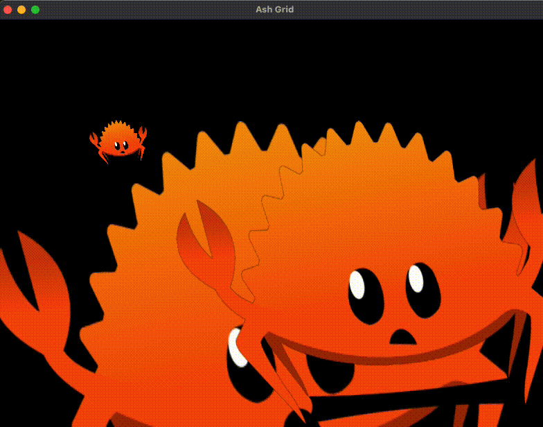

## Ash-Base

This project is based on and further refined from several ash and general vulkan examples:

* [The Ash Library Samples](https://github.com/ash-rs/ash/tree/660553c9184997c805c5a9f990395eab6d5e8dd4/ash-examples/src)
* [Vulkanalia documentation](https://kylemayes.github.io/vulkanalia/) even though it's not used in this project
* [The Vulkan tutorial website](https://vulkan-tutorial.com/)



## Warning

This project is very young, my understanding of vulkan and general gpu interaction is still growing, this project is quite inefficient so use it at your own risk.

## Debugging in VSCode

On MacOS, you may find that debugging fails because the rpath is missing libvulkan.1.dylib. You can fix this by creating a symlink to the Vulkan SDK directory library, change the version to the version you have installed.

```sh
ln -s ~/VulkanSDK/1.3.275.0/macOS/lib/libvulkan.1.3.275.dylib target/debug/libvulkan.1.dylib
```

## Running

run with the typical cargo run command

```sh
cargo run
```

#### Live Reloading

You can run this command for a "live reload" style

Install [cargo-watch](https://crates.io/crates/cargo-watch) with `cargo install cargo-watch`

```sh
RUST_BACKTRACE=1 ALWAYS_ON_TOP=1 VULKAN_DEBUG=1 cargo-watch -x run
```

#### Flamegraph

```sh
sudo -E zsh -ic "cargo flamegraph --freq 1994"
```
